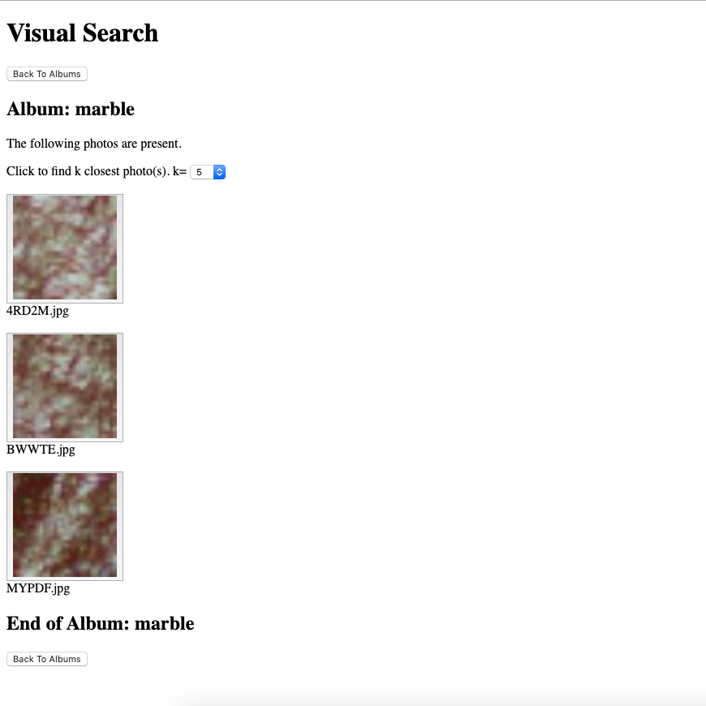
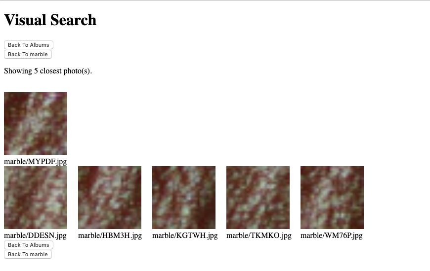

# Image Search Deployment with AWS

## Introduction
Using various AWS services, I built a [JavaScript web application hosted on S3](http://image-search-public.s3-website-us-east-1.amazonaws.com/) to perform search of an image and return *k* most similar images from a set of approximately 30,000 images.

## Walk-Through
The homepage lists a set of albums containing images grouped by type from which to pick the image for visual search.1

|  | 
|:--:| 
| *Home* |

Selecting an album (e.g. marble) will render a page with images that belong in the selected album. The user can then select the number of desired similar images (i.e. *k*) from a drop-down menu and then select the image on which to perform visual search. The values of *k* that are allowed ranges from 1 to 10.

|  | 
|:--:| 
| *Album Example* |

Once *k* (e.g. 5) is chosen, selecting an image (e.g. MYPDF.jpg) invokes a Lambda function, which performs the following actions:

- Log into an EC2 instance
- Execute a python script for visual search, which returns a list of paths for similar images in another bucket
- Execute a bash script to copy similar images to public bucket
- Return with location of copied images

A page is then rendered with the selected image, and a row of similar images beneath it.

|  | 
|:--:| 
| *Similar Images* |

The Lambda run time seems dependent on *k*, based on several runs:

| Trial | *k* | Download Key | SSH into EC2 | Download Selected Image from S3 | Load Hash Table, Featurize Image, Hash Search | Upload Results | Total Time |
|:--:|:--:|:--:|:--:|:--:|:--:|:--:|:--:| 
| 1 | 1 | 3.5s | 0.5s | 1s | 6s | 1.5s | 12s |
| 2 | 10 | 0.5s | 0.15s | 1s | 6s | 7.8s | 15.5s |
| 3 | 20 | 0.5s | 0.2s | 1s | 6s | 17.6s | 25s |
| 4 | 1 | 0.5s | 0.2s | 1s | 6s | 1.5s | 9.5s |
| 5 | 10 | 3.2s | 0.2s | 1s | 6s | 8.5s | 19s |  

## AWS Implementation
The AWS services used and their connections for creating the application are shown <a href="images/diagram.pdf">here</a>.2,3 In the process of building this application, listed below are facets of AWS that I began to develop familiarity with:

- S3 bucket permissions: Only the bucket hosting the website is accessible to the public
- Sizing compute:
	- Through trial and error, I determined that the t3.medium instance had the specs necessary for performing search; an 8 GB EBS volume is attached to it
	- I wanted the cheapest instance possible for accomplishing the task
	- t3.nano, t3.micro, and t3.small would exit with errors; I am under the impression that memory size was an issue
- IAM roles and policies:
	- The Lambda function and EC2 instance were given roles with policies attached to access other AWS services
	- I need to explore further how S3 bucket policies and IAM policies work together

## Visual Search
My initial approach had been to use SageMaker and run a k-NN algorithm,4 but I then decided that the application needed to give the user flexibility for choosing *k* without having to retrain the k-NN model. So I kept the portion of a pretrained ResNet-50 model imported from MXNet that performs feature extraction, and fed the extracted features through a locality sensitive hashing algorithm.5,6 The hash table of approximately 30,000 images was saved to a pickle file (530 MB). Parameters for feature extraction were also saved (90 MB) to be used later.

The hash table, feature extraction parameters, and python script that extracts features from an input image and queries the hash table with the extracted features were uploaded to the EC2 instance, which was used by the Lambda function to perform the search.

## References
1. https://docs.aws.amazon.com/sdk-for-javascript/v2/developer-guide/s3-example-photos-view.html
2. https://docs.aws.amazon.com/sdk-for-javascript/v2/developer-guide/using-lambda-functions.html
3. https://aws.amazon.com/blogs/compute/scheduling-ssh-jobs-using-aws-lambda/
4. https://aws.amazon.com/blogs/machine-learning/visual-search-on-aws-part-1-engine-implementation-with-amazon-sagemaker/
5. https://towardsdatascience.com/finding-similar-images-using-deep-learning-and-locality-sensitive-hashing-9528afee02f5
6. https://towardsdatascience.com/fast-near-duplicate-image-search-using-locality-sensitive-hashing-d4c16058efcb
